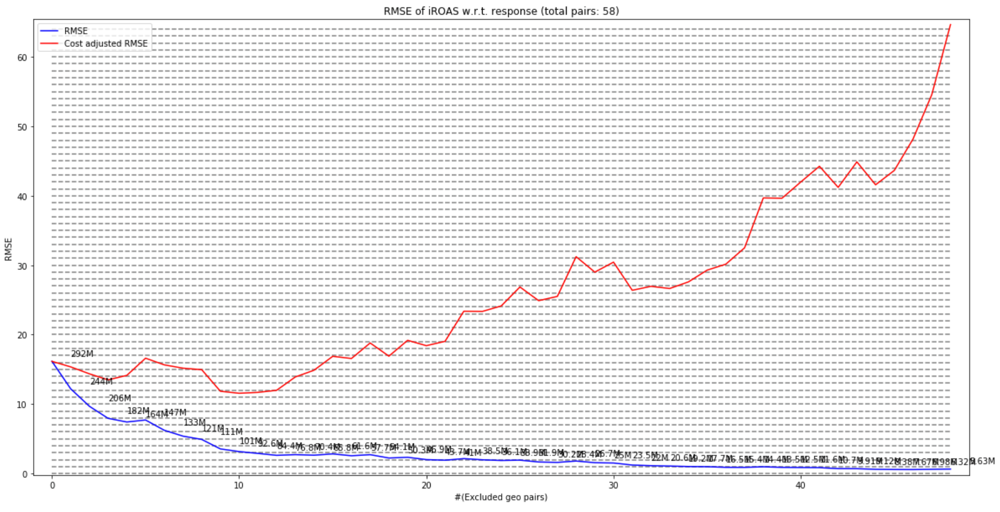
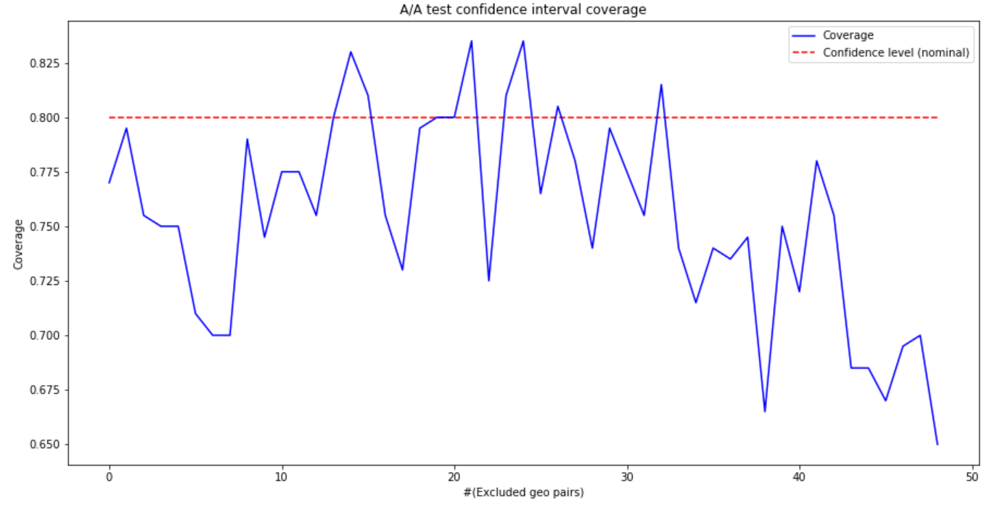
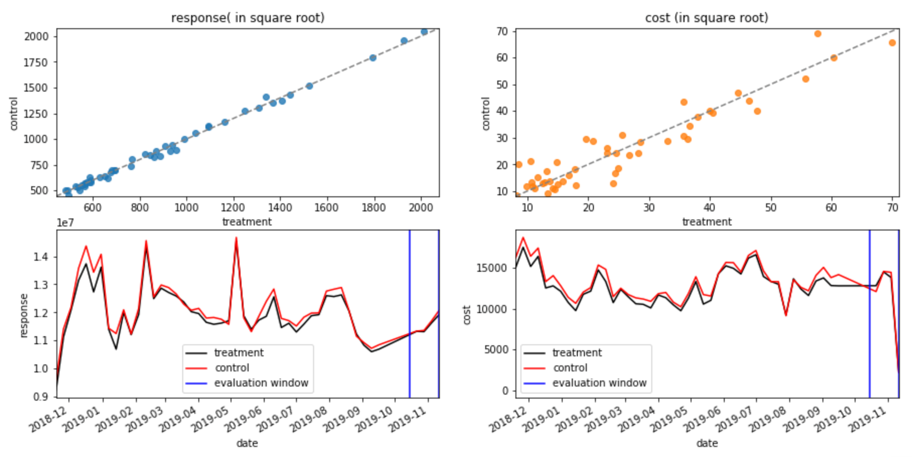
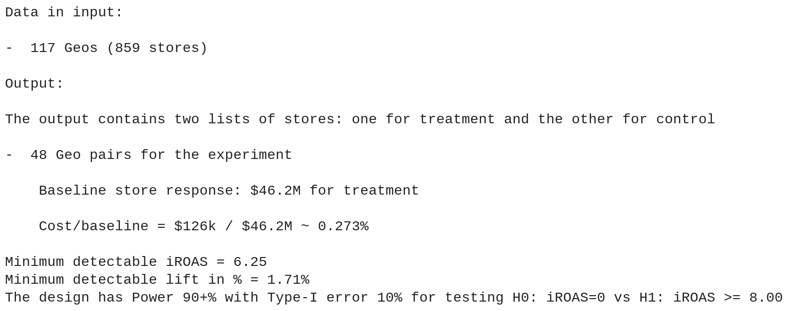

# Trimmed Match design colab guide

**Author**: Marco Longfils

With input from Isabel Marcin, Kate O’Donovan, Nicolas Remy, Aiyou Chen

Last updated on Jan 22, 2021

The purpose of this document is to guide you step by step in the process of
designing a randomized paired geo experiment using the
[Python library](https://github.com/google/trimmed_match) developed at Google.
For a technical description to the design process, please refer to the [Trimmed
Match Design paper](https://research.google/pubs/pub50322/), and this
[introduction](http://www.unofficialgoogledatascience.com/2016/06/estimating-causal-effects-using-geo.html)
to geo experiments. The colab can be found
[here](https://colab.sandbox.google.com/github/google/trimmed_match/blob/master/trimmed_match/notebook/design_colab_for_trimmed_match.ipynb).
At the end of this document you can find a glossary of the main terms in this
document.

[TOC]

## Data needed to run the Colab

In order to run the colab, you will need the following table

### client\_sales\_table:

*   **Description**: this table contains the response and spend data at the geo
    level and at daily/weekly frequency. The table should be specified in the
    colab by using the URL of the google sheet.

*   **Format**: Google sheet containing the following mandatory columns: date,
    response, cost, geo. Any additional column is ok.

*   **Example**:
    [here](https://github.com/google/trimmed_match/blob/master/trimmed_match/example_datasets/example_data_for_design.csv)

### pairs\_table [OPTIONAL]:

*   **Description**: this table is OPTIONAL. Leave empty if you don't want to
    specify the geo pairs. If specified, the design will use the specified geo
    pairs to run the power analysis. It is important that the geos has not been
    paired using observations from the chosen evaluation period below to avoid
    overfitting. For example, it can be used to evaluate a design on a different
    metric. This can be done by first running a design based on the main KPI
    (e.g. offline revenue) and then run the same colab where the “response”
    column in the client_sales_table is now the secondary KPI (e.g. online
    revenue) and passing the pairing as found in the output of the design using
    the main KPI (Worksheet named "geopairs" in the Google Sheet created in your
    Google Drive in cell 9).

*   **Format**: Google sheet containing the following mandatory columns: geo,
    pair, assignment. Any additional column is ok. The column pair should
    indicate the pair labels, and should be a number between 1 and N for a case
    with 2*N geos (or N pairs). The column assignment can be used to filter
    pairs, where a string equal to “Filtered” indicates a pairs that should be
    discarded from the design.

*   **Example**:
    [here](https://github.com/google/trimmed_match/blob/master/trimmed_match/example_datasets/example_geo_pairs.csv)

## Cell by cell description of the colab

### Data Input

#### Cell 1

[[View in colab](https://colab.research.google.com/github/google/trimmed_match/blob/master/trimmed_match/notebook/design_colab_for_trimmed_match.ipynb#scrollTo=dpra18_LEOCy)]

**Description**: This cell will install and load the necessary libraries and
build the C++ wrapper for the TrimmedMatch library. It can take some time to run
this cell.

**Action needed**: run the cell.

#### Cell 2

[[View in colab](https://colab.research.google.com/github/google/trimmed_match/blob/master/trimmed_match/notebook/design_colab_for_trimmed_match.ipynb#scrollTo=Wf400W5lQvz1)]

**Description**: This cell will load the client’s data needed to run the
analysis. You will be asked for permission to access your file in Drive. Follow
the instructions on screen.

**Action needed**: Before running the first cell, make sure to update the Google
Sheet url.

### Design with TrimmedMatch

#### Cell 3

[[View in colab](https://colab.research.google.com/github/google/trimmed_match/blob/master/trimmed_match/notebook/design_colab_for_trimmed_match.ipynb#scrollTo=djrjCfj0v4F7)]

**Description**: Select the parameters to be used in the design of a
TrimmedMatch. Briefly, we need to specify three time periods by specifying their
start and end dates, which will be used for different purposes.

1.  **Design period**: consisting of the two disjoints set: training period,
    used to pair the geos based on their overall response during this period,
    and evaluation period, used to evaluate a design. The duration of this
    period can be unlimited. As default for the design period we suggest to use
    the entire time period in the **client\_sales\_table**. The training period
    consists of any day in the design period which is not in the evaluation
    period, as defined below.
2.  **Evaluation period**: used to evaluate the RMSE and the minimum detectable
    iROAS. The duration of this time period should be equal to the planned
    experiment duration. For example, if the client wants to run a 4 weeks
    experiment, then the evaluation period should be 4 weeks. We recommend to
    try to create a design with the evaluation period as:

    *   The most recent 4 weeks (default)
    *   Using 4 weeks from the previous year in the corresponding month in which
        the experiment is planned to be run. For example, if we plan to launch
        the experiment in May 2020, then select the evaluation period as 4 weeks
        in May 2019 (if the data are available).
    *   **Coverage test period**: used to perform AA test and compute the
        coverage probability for the confidence intervals. The duration of this
        period should be equal to that of the evaluation period.

**N.B.**: the evaluation period and the AA test period should NOT overlap. The
training period can overlap with any other period.

*   **geox\_type** indicates the type of ad spend change. There are 3 categories
    of experiments as they relate to ad-spend changes: HOLD BACK, HEAVY UP, or
    GO DARK.
*   **significance\_level** indicates the significance level for testing the
    hypothesis H0: iROAS = 0 vs. H1: iROAS > 0. The value of this parameter
    should be a real number between 0 and 1. The default value is 10%.
*   **power\_level** indicates the power that we would like to achieve in our
    design. The value of this parameter should be a real number between 0 and 1.
    The default value is 80%.
*   **design\_start\_date** indicates the first day in the design period. The
    default value is the first available day in the client\_sales\_table.
*   **design\_end\_date** indicates the last day in the design period. The
    default value is the last day available in the client\_sales\_table.
*   **eval\_start\_date** indicates the first day in the evaluation period.
    **coverage\_test\_start\_date** indicates the first day in the coverage test
    period.
*   **experiment\_duration\_in\_weeks** length of the experiment (and AA test)
    measured in weeks. For example, set this parameter to 4 if you want to
    design an experiment lasting 4 weeks.
*   **experiment\_budget** is the maximum budget the client is willing to spend
    on the campaign.
*   **alternative\_budget** is a list of budgets, separated by a comma, that can
    be used to “override” the automated budget choices based on the
    **experiment\_budget**. The default value is an empty field.** **

    Example

{style="display:block;margin:auto"}

*   **minimum\_detectable\_iROAS** is defined as the value of the true iROAS
    such that, given a **significance\_level** significance level for a
    one-sided test, gives a **power\_level** power if the true iROAS is equal to
    the minimum detectable iROAS. For example, if the **significance\_level**
    used is 10%, and the **power\_level** is 80%, then the
    **minimum\_detectable\_iROAS** is the smallest value such that we have 80%
    chance of detecting an effect of that size with a 10% probability of a false
    positive.

    The default value of the minimum detectable iROAS is 3, but should be
    changed depending on the business vertical of the client. For example, for
    grocery stores we recommend a value of 2.

*   **average\_order\_value** is the mean value in dollars that the client
    attributes to a transaction/visit/contract. Use a value of 1 if the design
    is based on sales/revenue or an actual average order value (e.g. 80$) for a
    design based on transactions/footfall/contracts. The default value is 1.
    N.B.: make sure to use a value of 1 if the response variable of interest is
    revenue/sales.

*   **geos\_exclude** can be used to list all geos, separated by a comma, which
    should be excluded from the design and experiment. The default value is an
    empty field. The reasons to exclude a geo includes (but are not limited to):

*   Client would like to use only a subset of the stores, and thus we remove the
    corresponding geos to avoid contamination.

*   The geo contains newly opened/disrupted stores which should be excluded.

    Example

{style="display:block;margin:auto"}

*   **day\_week\_exclude** can be used to list days and/or weeks, separated by a
    comma, which should be excluded from the design. The default value is an
    empty field. The format for time periods is "YYYY/MM/DD - YYYY/MM/DD", where
    the two dates specify the start and end date for the period. The format for
    days is "YYYY/MM/DD". Leave empty to use all days/weeks.

    Please make sure that the excluded days/weeks do not overlap with either the
    evaluation or AA test periods. If you attempt to remove dates in the
    evaluation or AA test period an error will be raised and you will be asked
    to change these two time periods. The reasons to exclude days/weeks.
    includes (but are not limited to):

    *   A week was used in a previous geo experiment.

    *   A day/week was disrupted, e.g. due to Covid-19.

    Example

{style="display:block;margin:auto"}

**Action needed**: update the value of the parameters to the desired levels.

#### Cell 4

[[View in colab](https://colab.research.google.com/github/google/trimmed_match/blob/master/trimmed_match/notebook/design_colab_for_trimmed_match.ipynb#scrollTo=QQ6f5BQGTp9K)]

**Description**: Summary of the designs given the parameters specified in Cell
3. Each row in the table corresponds to a design in the output of this cell, see
the figure below for an example. Orange rows/cells indicate that one or more
conditions are not met in the design, e.g. the minimum detectable iROAS of the
design is larger than what was set in input. Green rows correspond to the
optimal and recommended designs, while rows in beige contain designs which are
feasible but require a higher budget. Other metrics may be highlighted in red if
they don’t meet some criterion (e.g. if the minimum detectable lift in response
is too large)

{style="display:block;margin:auto";width="400" height="400"}

**Action needed**: run the cell.

#### Cell 5

[[View in colab](https://colab.research.google.com/github/google/trimmed_match/blob/master/trimmed_match/notebook/design_colab_for_trimmed_match.ipynb#scrollTo=2nntS-sRsnUE)]

**Description**: Select the design that you choose as the final design to be
used in the experiment. The design number is the number displayed in the table
from Cell 4 as shown in the figure below. The default design is Design 1, which
outputs the least expensive design based on the minimal iROAS and power.

{style="display:block;margin:auto";width="400" height="400"}

**Action needed**: select the design and run the cell.

This cell contains a few lines of code that allows to override the automatic
selection of the number of pairs to filter from the experiment. In this way, we
have the flexibility to filter more/less during the design. In the appendix, the
usual RMSE curve is shown for all the designs, and one can use that to decide
how many pairs to filter from the experiment.

#### Cell 6

[[View in colab](https://colab.research.google.com/github/google/trimmed_match/blob/master/trimmed_match/notebook/design_colab_for_trimmed_match.ipynb#scrollTo=Bb_vBJWlVjto)]

**Description**: Visualization of the balance between control and treatment
group in the chosen design. There are 4 subpanels in total:

*   Top-left: scatterplot of the (square root of the) response variable paired
    according to the design. Each dot corresponds to one pair of geos, where the
    x-axis represents the response value for the treatment geo in the pair, and
    the y-axis the response value for the control geo in the same pair. Ideally,
    the dots should be close to the dashed diagonal line, which indicates a
    balance/similarity between the geos in the same pair.
*   Top-right: scatterplot of the (square root of the) cost variable paired
    according to the design. Each dot corresponds to one pair of geos, where the
    x-axis represents the cost value for the treatment geo in the pair, and the
    y-axis the cost value for the control geo in the same pair. Ideally, the
    dots should be close to the dashed diagonal line, which indicates a
    balance/similarity between the geos in the same pair.
*   Bottom-left: time series of the response aggregated at the group (treatment,
    control) level. The evaluation period is the time period contained within
    the two vertical blue lines. Ideally, the red and dark lines follow each
    other closely over time, indicating that there is a strong correlation
    between the response in the two groups.
*   Bottom-right: time series of the cost aggregated at the group (treatment,
    control) level. The evaluation period is the time period contained within
    the two vertical blue lines. Ideally, the red and dark lines follow each
    other closely over time, indicating that there is a strong correlation
    between the cost in the two groups.

{style="display:block;margin:auto"}

**Action needed**: run the cell.

#### Cell 7

[[View in colab](https://colab.research.google.com/github/google/trimmed_match/blob/master/trimmed_match/notebook/design_colab_for_trimmed_match.ipynb#scrollTo=mAq_LHr-sia8)]

**Description**: pairwise time series plot of the response variable for the
pairs of geos which have not been filtered. The title of each subpanel indicates
which pair is plotted, with the two geos and their assignment (control,
treatment) shown in the legend. The training period is enclosed in the two
vertical red lines, the evaluation period in the two vertical black lines.

Note that, while it is not required, it would be better to have a strong
correlation between the time series of the two geos in a pair.

{style="display:block;margin:auto";width="400" height="400"}

**Action needed**: run the cell.

### Summary of the design and save the pretest data, the geo pairs, treatment and control stores in a Google Sheet.

#### Cell 8

[[View in colab](https://colab.research.google.com/github/google/trimmed_match/blob/master/trimmed_match/notebook/design_colab_for_trimmed_match.ipynb#scrollTo=WTQBzZio9gPc)]

**Description**: print the summary of the selected design with information about
expected RMSE, minimum detectable lift, and minimum detectable lift as %. This
is a useful copy and pasteable summary which can be sent in an email.

{style="display:block;margin:auto"}

**Action needed**: run the cell.

#### Cell 9

[[View in colab](https://colab.research.google.com/github/google/trimmed_match/blob/master/trimmed_match/notebook/design_colab_for_trimmed_match.ipynb#scrollTo=vUoYgJ4O28nV)]

**Description**: save the design, including the geo-level pretest data
(response+cost), geo pairs, treatment and control geos, in the Google Sheet with
name specified as input. The Google Sheet is saved in your Google Drive under
“My Drive”.

{style="display:block;margin:auto"}

**Action needed**: Change the name of the file and run the cell.

### Appendix: (Anything in Appendix is OPTIONAL)

**Detailed results of the design**

#### Cell 11

[[View in colab](https://colab.research.google.com/github/google/trimmed_match/blob/master/trimmed_match/notebook/design_colab_for_trimmed_match.ipynb#scrollTo=Z5J-6eZQxUgz)]

**Description**: this cell outputs details and additional information about the
designs in the Cell 4 “Summary of the designs”. In particular:

1.  We plot, for each budget, the RMSE curve as a function of the number of
    pairs filtered. It can be used to decide how many pairs to filter, and
    determine the resulting minimum detectable iROAS.

{style="display:block;margin:auto"}

1.  Table containing the value shown in the figure in 1)
2.  The coverage probability (as a function of the number of pairs filtered) for
    the confidence intervals against the nominal value used.

{style="display:block;margin:auto";width="200" height="200"}

**Action needed**: run the cell.

## Glossary

**AA test:** an AA test can be thought of as an AB test or an experiment in
which there is no difference between the two groups (treatment and control).
Such a test can be used as a diagnostic tool. Since we know that there is no
difference between the groups, if we find a statistically significant result, it
may indicate that there is some confounding factor in the design which would
compromise the actual experiment.

**Coverage test period:** time period which will be used to perform an AA test
as diagnostic, defined as any day between the corresponding start/end dates.
Checking the coverage probability of the confidence interval is necessary to
guarantee that the true confidence level (true coverage) is close to the nominal
confidence level (nominal coverage).

**Colab:** Data analysis tool that combines code, output and descriptive text
into one document. You can create a template for data analysis and let other
people smoothly run it (as we do for GeoX design and analysis).

**Design dataset :** this is a synonym for the **client\_sales\_table, **i.e.
the dataset containing the time series of response and cost at the geo level
during the time period preceding the experiment.

**Design period:** time period which will be used to design the experiment,
defined as any day between the corresponding start/end dates.

**Evaluation period:** time period which is used to perform the power analysis,
defined as any day between the corresponding start/end dates. This period should
be representative of the period in which the experiment will take place both in
terms of seasonality and length (e.g. same number of weeks).

**Geo:** region which can be targeted by a campaign and used as the unit during
the experiment. Each geo can be treated, controlled, or excluded from the
experiment. Examples of geos are the standard DMA (by Nielsen in US), GMA
(Generalized Marketing Areas) or dynamic GMAs.

**Pretest data:** this is a synonym for the **client\_sales\_table**, i.e. the
dataset containing the time series of response and cost at the geo level during
the time period preceding the experiment.

**RMSE:** acronym for Root Mean Squared Error, a measure of the variability of
the iROAS estimate. The larger the RMSE, the more variable (and hence more
difficult/expensive to detect) the iROAS estimate will be. It is mainly used to
perform the power analysis.
